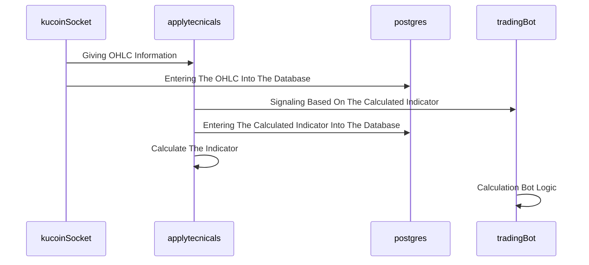

# Kucoin-Trading-Bot
## Introduction
Introducing the KuCoin trading bot - your ultimate tool for optimizing your cryptocurrency trading strategy. Our bot is specifically designed to work with the KuCoin exchange, one of the fastest-growing cryptocurrency platforms in the world. With our bot, you can automate your trades, take advantage of market trends, and maximize your profits - all with minimal effort on your part.


## kucoinSocket.py
In this script, by using websocket, we were able to receive the live information of the candle and save it using the Postgres database.

Websocket OHLC chart data refers to real-time streaming of price data in the form of Open, High, Low, and Close (OHLC) values for financial instruments such as stocks, forex, or cryptocurrencies. This data is typically delivered through a WebSocket connection, which enables bidirectional communication between a server and a client in real-time.
One of the advantages of using WebSocket technology is that it allows for much faster data transmission than traditional HTTP requests. This means we can receive real-time updates on market movements and price changes in milliseconds, giving us a significant advantage over traders who rely on slower data feeds.

PostgreSQL is an open-source, object-relational database management system (DBMS) that is widely used for developing scalable and high-performance applications, using PostgreSQL for saving OHLC candlestick data give us several advantages such as:

1. Reliability: PostgreSQL is known for its reliability and robustness. It provides built-in mechanisms for data integrity, backup, and recovery, which make it a great choice for storing important financial data.

2. Scalability: PostgreSQL is highly scalable, and it can handle large amounts of data with ease. This is important for storing OHLC candlestick data, which can grow very quickly over time.

3. Flexibility: PostgreSQL provides a wide range of data types and indexing options, which makes it highly flexible for storing OHLC candlestick data. This enables developers to optimize the database for their specific needs and to run complex queries quickly.

4. Performance: PostgreSQL is designed for high-performance and can handle complex queries with ease. This is important for OHLC candlestick data, which often requires complex analysis and calculations.

## applytecnicals.py
In this script, with using the data received from the kucoinSocket.py We were able to calculate the combination of two indicators(SSL channel & TSI) which is one of our strategies and transfer the answer to the tradingBot.py according to the signal that indicator gave us and trade based on it, And finally, we entered the calculated information into PostgreSQL

With using this script, we can convert different strategies into Python language and define as many strategies as desired for the bot itself.

!!!SSL channel & TSI indictor was one of our strategies!!!

## tradingBot.py
In this script, the logic of our bot is built to determine when is suitable to enter a position and when to exit according to the information provided by the indicator.

This bot uses the capital management system and the risk-to-reward system, which is one of the remarkable features of this robot

Capital management system and risk-to-reward system are two critical components of successful trading strategies. some advantages of using these systems:

Capital Management System:

1. Minimizes Risk: Capital management system helps in minimizing the risk of loss by determining the amount of money to be invested in each trade based on available capital and risk tolerance.

2. Maximizes Profits: By effectively managing capital, traders can increase their profits and make the most of their trades.

3. Reduces Emotions: A capital management system helps traders to stick to a consistent strategy and avoid making impulsive decisions based on emotions such as fear or greed.

4. Increases Discipline: A capital management system helps traders to maintain discipline in their trading by setting and adhering to predetermined risk levels.

Risk-to-Reward System:

1. Maximizes Profits: The risk-to-reward system helps traders to identify trades with a high potential for profit while minimizing the risk of loss.

2. Improves Decision-Making: By calculating the potential risk and reward for each trade, the risk-to-reward system helps traders to make informed and calculated decisions.

3. Reduces Risk: The risk-to-reward system helps to reduce the risk of loss by ensuring that the potential reward outweighs the potential risk.

4. Increases Consistency: A risk-to-reward system helps traders to maintain consistency in their trading by setting predetermined risk and reward ratios for each trade.

## Optimizations

To connect these three scripts, which are dependent on each other and must work together, we used RabbitMQ  instead of using the usual methods that reduce our performance.

RabbitMQ is an open-source message broker software that is designed to support message queuing, message-based architectures, and asynchronous communication.


## Environment Variables

To run this project, you will need to add the following environment variables to your .env file


`DB_HOST` `{default : localhost}`

`DB_NAME`

`DB_USERNAME`

`DB_PASSWORD`

`DB_PORT` `{default : 5432}`

`MQ_EXPIRATION_TIMEOUT` `{default : 20000}`

`KUCOIN_APIKEY`

`KUCOIN_API_SECRET`

`KUCOIN_API_PASSPHARSE`

`MQ_USERNAME` `{default : guest}`

`MQ_PASSWORD` `{default : guest}`

`MQ_HOST` `{default : 127.0.0.1}`

`MQ_PORT` `{default : 5672}`

`MQ_VHOST` `{default : /}`


## Run Locally

Clone the project

```bash
  git clone https://github.com/JUMPEDATOM/Kucoin-Trading-Bot.git
```

Go to the project directory

```bash
  cd Kucoin-Trading-Bot
```

Install dependencies

```bash
  pip install -r requirements.txt
```

Run in sequence

```bash
  1. python kucoinSocket.py
  2. python applytecnicals.py
  3. python tradingBot.py

```


## License

[MIT](https://choosealicense.com/licenses/mit/)

